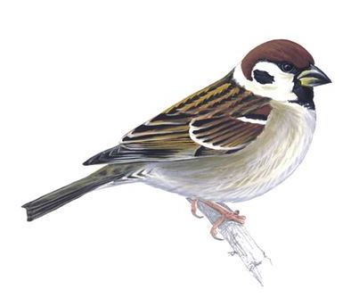
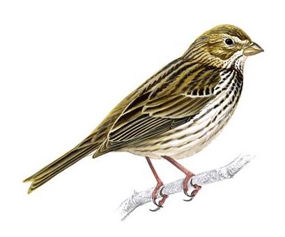
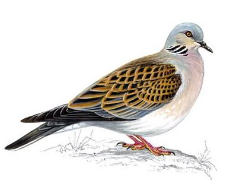
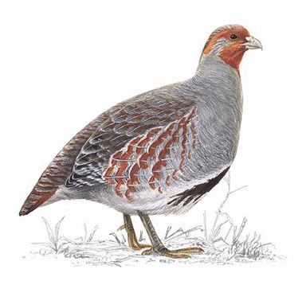
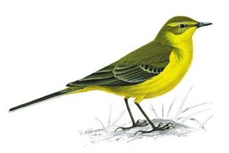
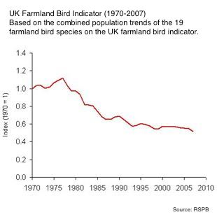
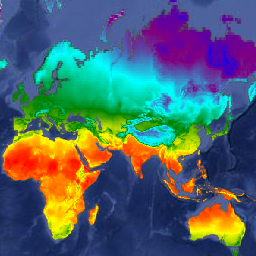
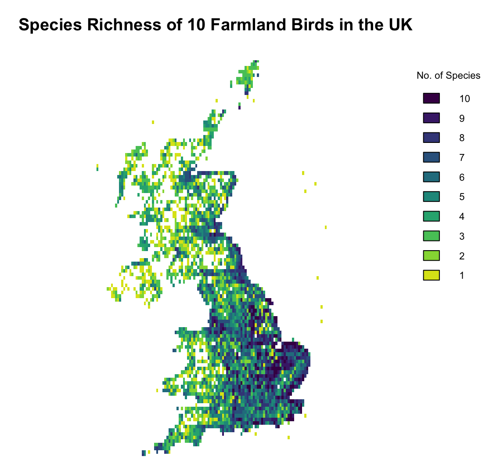
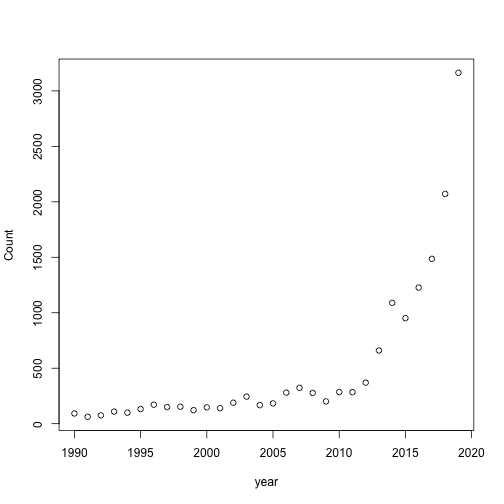

Which climate factors affect bird observations in the UK?
======================================================== 
author: Florence Galliers
date: 17/03/2021
width: 1440
height: 900

<style>
.small-code pre code {
  font-size: 1em;
}
</style>

- Problem Outline
- Objectives
- Data
- Approach
- Comments

The Problem
========================================================
An increasing number of species are being added to both local and global red lists for being endangered or threatened. 

In the UK, over half of farmland bird species are on the Red List. This is due to a number of factors including changes in farming practices, increased field sizes and predation.

But have changes in the climate had an impact on the number of bird species that are seen?

   


Objectives
========================================================
**Assess which variables are most influential on the number of bird observations**

**Do the number of individual observations and the number of species (species richness) follow the same trends?**

**Do GBIF observations agree with other sources of bird data when it comes to endangered / red list species? E.g. Breeding Bird Survey UK.**

  

Data
========================================================
class: small-code
The **eBird** Dataset is managed by the Cornell Lab of Ornithology, it combines global bird observation data and is accessible via GBIF.

705 million observations worldwide

8 million from the UK. 

I am planning on using a subset of these, but this shows the potential of scaling this analysis up to use a larger datasets.


```
              species decimalLatitude decimalLongitude day month year
1     Passer montanus         50.9458         0.919592  24     2 2019
2   Emberiza calandra         51.8183        -0.623599  15     4 2017
3     Motacilla flava         50.7373         0.240869   5     9 2014
4   Emberiza calandra         52.9473         0.614915  10     5 2014
5 Streptopelia turtur         52.4961         0.849025  25     6 2000
6       Perdix perdix         53.5149        -1.358180  28     2 2005
```

This is just a select few columns, when downloaded from GBIF there are 50 different columns available.


Github repo: https://github.com/FlorenceGalliers/big-data


Climate Data: Worldclim Bio Variables Dataset.
=========
<table class="table" style="font-size: 28px; margin-left: auto; margin-right: auto;">
 <thead>
  <tr>
   <th style="text-align:left;"> WorldClim Bio Variables </th>
  </tr>
 </thead>
<tbody>
  <tr>
   <td style="text-align:left;"> BIO1 = Annual Mean Temperature </td>
  </tr>
  <tr>
   <td style="text-align:left;"> BIO2 = Mean Diurnal Range (Mean of monthly (max temp - min temp)) </td>
  </tr>
  <tr>
   <td style="text-align:left;"> BIO3 = Isothermality (BIO2/BIO7) (×100) </td>
  </tr>
  <tr>
   <td style="text-align:left;"> BIO4 = Temperature Seasonality (standard deviation ×100) </td>
  </tr>
  <tr>
   <td style="text-align:left;"> BIO5 = Max Temperature of Warmest Month </td>
  </tr>
  <tr>
   <td style="text-align:left;"> BIO6 = Min Temperature of Coldest Month </td>
  </tr>
  <tr>
   <td style="text-align:left;"> BIO7 = Temperature Annual Range (BIO5-BIO6) </td>
  </tr>
  <tr>
   <td style="text-align:left;"> BIO8 = Mean Temperature of Wettest Quarter </td>
  </tr>
  <tr>
   <td style="text-align:left;"> BIO9 = Mean Temperature of Driest Quarter </td>
  </tr>
  <tr>
   <td style="text-align:left;"> BIO10 = Mean Temperature of Warmest Quarter </td>
  </tr>
</tbody>
</table>


***
<table class="table" style="font-size: 28px; margin-left: auto; margin-right: auto;">
 <thead>
  <tr>
   <th style="text-align:left;">  </th>
  </tr>
 </thead>
<tbody>
  <tr>
   <td style="text-align:left;"> BIO11 = Mean Temperature of Coldest Quarter </td>
  </tr>
  <tr>
   <td style="text-align:left;"> BIO12 = Annual Precipitation </td>
  </tr>
  <tr>
   <td style="text-align:left;"> BIO13 = Precipitation of Wettest Month </td>
  </tr>
  <tr>
   <td style="text-align:left;"> BIO14 = Precipitation of Driest Month </td>
  </tr>
  <tr>
   <td style="text-align:left;"> BIO15 = Precipitation Seasonality (Coefficient of Variation) </td>
  </tr>
  <tr>
   <td style="text-align:left;"> BIO16 = Precipitation of Wettest Quarter </td>
  </tr>
  <tr>
   <td style="text-align:left;"> BIO17 = Precipitation of Driest Quarter </td>
  </tr>
  <tr>
   <td style="text-align:left;"> BIO18 = Precipitation of Warmest Quarter </td>
  </tr>
  <tr>
   <td style="text-align:left;"> BIO19 = Precipitation of Coldest Quarter </td>
  </tr>
</tbody>
</table>

This data can be downloaded in various resolutions. 
Some of these variables will be highly correlated and so variable selection will take place.

Source: https://www.worldclim.org/data/bioclim.html

Approach
=========================
Break down UK into a grid, and assign each square a score for:

1. Number of observations

2. Species richness (number of different species)

3. Species richness of 10 most at risk farmland bird species

(Tree sparrow, Corn bunting, Turtle dove, Grey partridge, Yellow wagtail, Starling, Linnet, Lapwing, Yellowhammer, Skylark)
***



Analysis Ideas
============
Create model to show which climate variables are the most influential on the scores.

Regression analysis: linear or generalised linear regression:
- Poisson regression = uses count data, for the number of observations
- Use model selection to reduce the number of variables by backward selection
- Assess models using AIC, and/or other criteria

All analysis will take place within Spark framework.

Comments
============================
Have to take into account that this is 'citizen science' observation data and so observations have increased in frequency as technology has become more widely used and accessible.

Example: Tree Sparrow Observations over time in the UK. 


***

Decide the best resolution to make the grid when I break down the UK. Some options are 100km, 10km, 1km...?

Must also remember that this data does not include every bird that is out there, only ones that have been reported.

Land Use!

